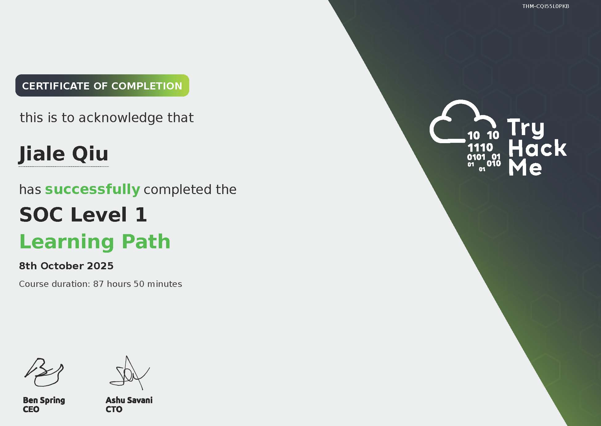
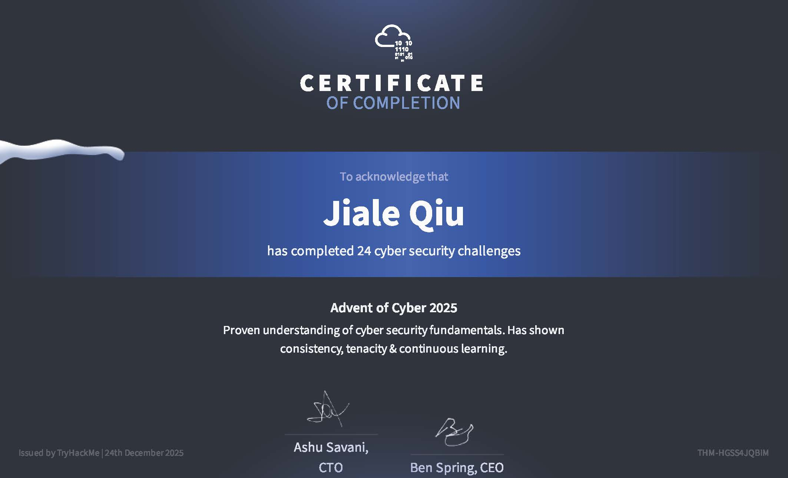

# Certificates
Certificates to affirm my learning.

## Tryhackme SOC Level 2 Learning path
- (https://tryhackme-certificates.s3-eu-west-1.amazonaws.com/THM-ITZJXOA09E.pdf)

The SOC Level 2 learning path on TryHackMe goes in-depth into specializations of defensive work, focusing more on skills found in a tier 2 security analyst. This learning path delves into a variety of topics, such as:
- log analysis
- advanced SIEM usage in both Splunk and Elastic (ELK)
- basic detection engineering using Sigma rules
- threat hunting and emulation via Atomic Red Team and CALDERA
- basic incident response
- malware analysis, including basic and dynamic with Ghidra, PEStudio, and default Linux Tools such as the `strings` commmand

## Tryhackme SOC Level 1 Learning path
- (https://tryhackme-certificates.s3-eu-west-1.amazonaws.com/THM-CQI55L0PKB.pdf)

The SOC Level 1 learning path on TryHackMe is an entry-level learning path that focuses primarily on skills required in a SOC Tier 1 Analyst. It focuses on cybersecurity fundamentals and attack types, and teaches alert prioritization and triaging. It also delves into monitoring network and web attacks.

## Tryhackme Advent of Cyber 2025 Event
- (https://tryhackme-certificates.s3-eu-west-1.amazonaws.com/THM-HGSS4JQBIM.pdf)

The 2025 Advent of Cyber event on TryHackMe includes a broad and diverse introduction to many concepts, both red team and blue team. It covers light onto many topics, such as:
- Forensics (Web, Registry)
- Detection (C2, YARA rules)
- Pentesting (Race Conditions, IDOR, Prompt Injection, Container Escape)
- Password Cracking
- SIEM basics (Splunk, Alert Triage)
- Cloud (AWS and Azure)

