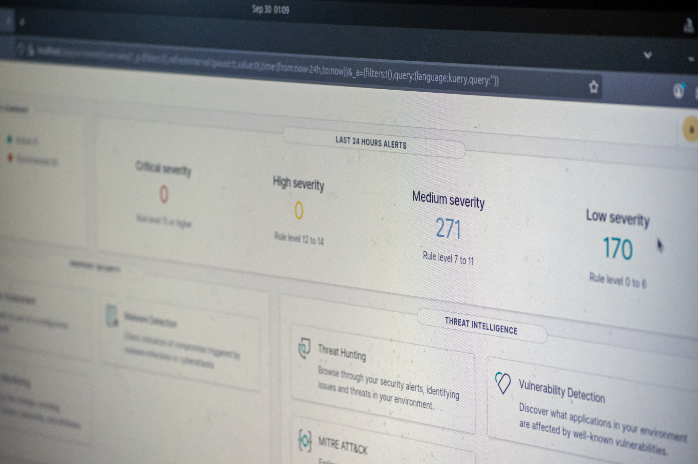

# Progress Check 3: Homelab Main Setup Finished
Date: 9/30/2025

## Infrastructure Overview

## OPNsense & Wifi Router

OPNsense is a firewall and routing platform used to manage networks.

For my homelab, I wiped the OS off of an old laptop (that was older than me!) and replaced it with OPNsense. At first, OPNsense was a bit overwhelming with its wide range of features. However, after a bit more reading, I managed to get the network up and running. Unfortunately, I faced a
new issue as I realized that I did not have enough Ethernet ports to fulfill the needs of my homelab. This was when I realized I should use WLAN instead, to get rid of Ethernet cables and make my homelab easier to connect to. I took a spare router from my parents and used it to fulfill wireless requests. After that, I set up a DHCP server and set static IP addresses to the Juice Shop and Analyst VM.
## Security Analyst VM
  

This is an installation of Ubuntu running on VirtualBox. Here, I will monitor endpoints using Wazuh.

### Wazuh
Wazuh manager is installed on the Security Analyst VM. Wazuh will be utilized to collect logs and alerts from the Juice Shop.

## OWASP Juice Shop

The OWASP Juice Shop is an intentionally insecure web application. It also comes with a wide range of challenges.

I will complete challenges, see what logs appear on Wazuh, and see how each action corresponds to a log. I will also write reports on remediation actions recommended for each challenge I complete.

## Attacker VM
I will be using Kali Linux to attack the OWASP Juice Shop.

Kali comes with a wide suite of pentesting tools that I can use against the juice shop.