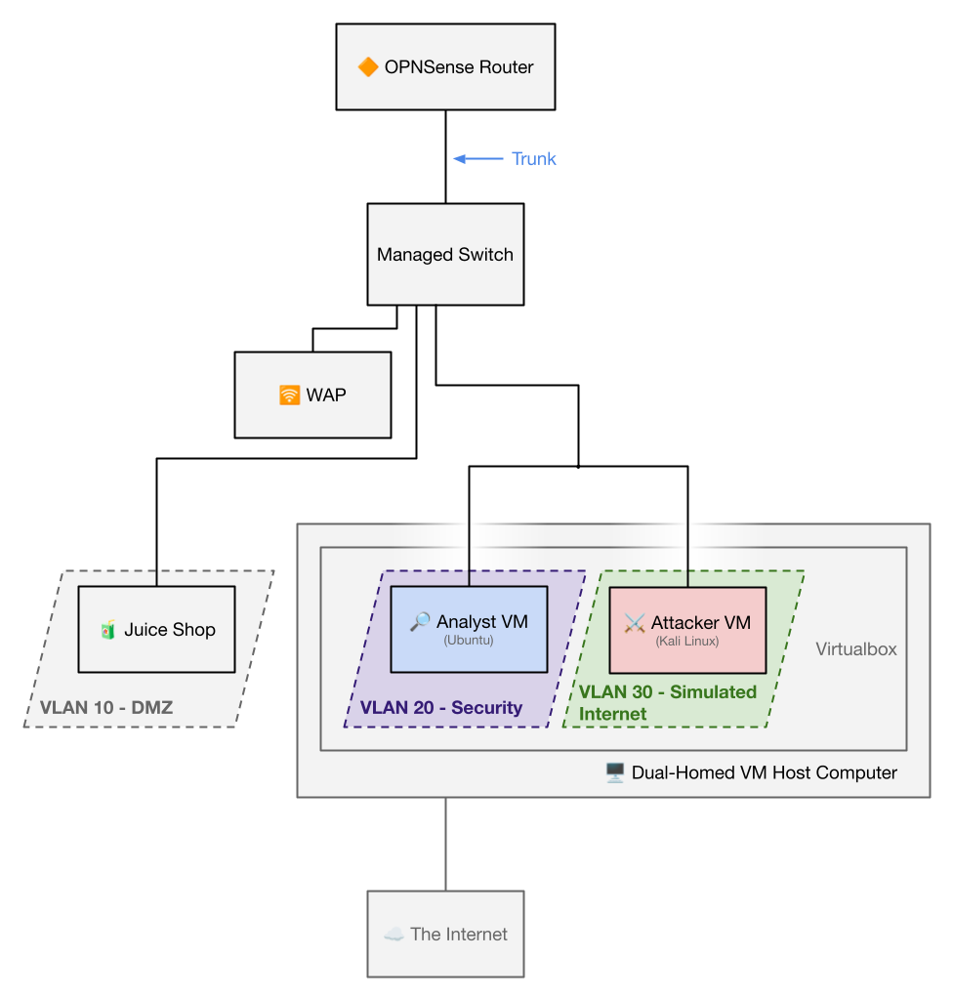
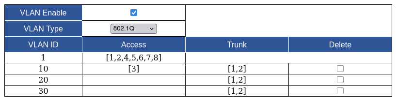
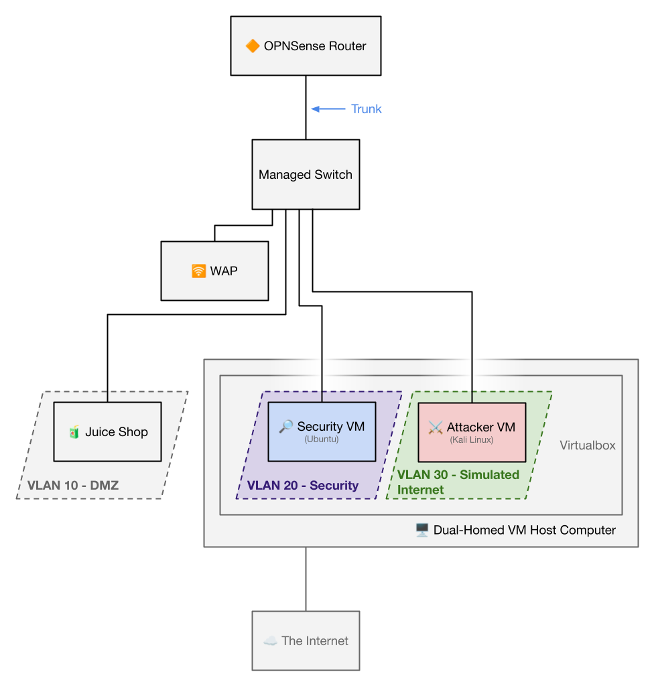
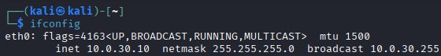
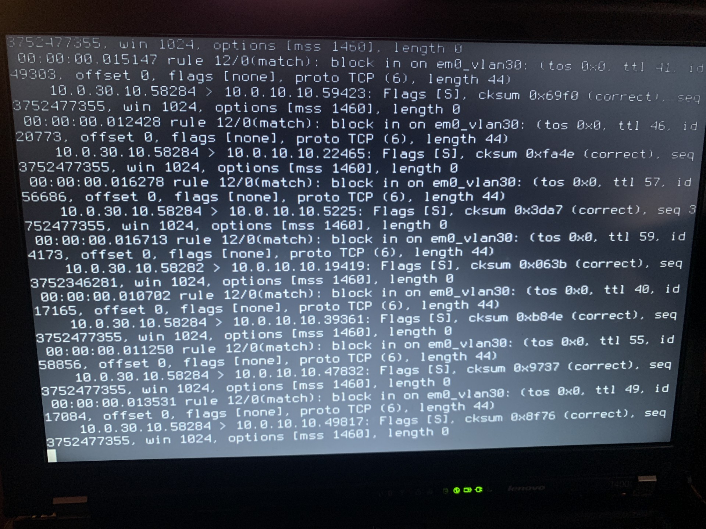

# Homelab Entry #4: Network Revamp & Router-on-a-Stick Architecture Implementation

## 『 ⭐ Project overview & Key Outcomes 』

In order to secure my Homelab network and better match an enterprise network, I rearchitected my homelab network to move away from a single flat subnet and instead utilize a multi-VLAN Router-on-a-Stick configuration.

### / 💠 Concepts Applied /
- VLAN segmentation and subnets with 802.1Q VLAN Tagging
- Firewall floating rules on OPNSense
- Network setup for Virtual Machines (on Virtualbox)
- Firewall testing and validation (via Nmap)

### / 🏆 Core Achievements /
- Properly implemented the Router-on-a-Stick networking configuration on my Homelab
- Designed and configured three VLANs (DMZ, Security, and a simulated WAN)
- Verified success of firewall implementation via Nmap port scans

## 『 1️⃣ Major Network Revamp and Router-on-a-Stick (RoaS) setup 』

Coming back to this homelab, I realized I needed a serious revamp of the network. Primarily, I wanted to use VLANs to create a DMZ for the Juice Shop webapp.

Unfortunately, my device running OPNSense has only one ethernet port. If I wanted to incorporate VLANs into my homelab, my best bet was to utilize trunking and run a Router-on-a-Stick topology. I purchased a managed switch and while I waited for it to arrive, I drew up the planned network architecture in Google Drawings.

It is fairly simple. At the very top, I have the OPNSense router trunked to the managed switch. This switch will manage three VLANs:
- A demilitarized zone. This is where "public" facing endpoints go, such as the Juice Shop webapp.
- A security VLAN. This is where endpoints used for security purposes will typically go, like my Security VM used to ingest logs from the Elastic Stack.
- A simulated internet. The Juice Shop won't actually be exposed to the public-facing internet, so this VLAN will be treated with a firewall built as if it was from the public-facing internet.

My desktop will host two different VMs: The attacker VM and the security VM. Due to limitations with the amount of Ethernet ports I have, I will need to trunk the two VMs into the same port on my Managed Switch and use tagging.

*Note: Later on I find a second ethernet port on my computer and use that instead. The port mentioned here is no longer trunked*

The full drawing of the network architecture can be seen below:

A few days later my switch arrives, so now its time to set up my network for real. First off, I have to correct some major misconfigurations. There were two primary mistakes I made, but both were quick fixes:
- The TP-Link WAP was not actually set to AP mode. I fixed this by going into the router's management portal and disabling the DHCP server.
- The Entire LAN network was assigned to the WAN interface. I used OPNSense's CLI to remove the WAN interface and add a LAN interface instead. While I do that, I also changed my homelab's subnet from `192.168.1.x` to `10.0.x.x`. This prevents my home network from interfering too much with my homelab network.

I honestly don't know how I made those mistakes a few months ago. At least now I know I've gotten more competent in networking fundamentals. Once I got those misconfigurations fixed, I got to plugging everything in as detailed in my network architecture above. 

## 『 2️⃣ VLAN Configuration 』

Next, I setup the VLANs for my network. I'll have to configure this in both my switch and in OPNSense. Because there will be three VLANs in this network (DMZ, Security, and fake internet), I assign port 3 as an access port for the DMZ and port 2 as a trunk port for the two other VLAns. Port 1 will also be used as the trunk port but straight into the router. You can see this configuration below.

Unfortunately, I soon realized that Virtualbox does **not** support VLAN tagging and trunking on Windows hosts, meaning that a trunk cable won't be a viable option without Windows 11 Pro. Next, I tried to create virtual adapters with the Realtek Ethernet Diagnostic Utility, but that didn't work as Virtualbox was not identifying the virtual adapters no matter what I did. In the end, I ended up using the second ethernet port on my computer after finding it when diagnosing the Realtek utility.

Below is my new updated network architecture without the second trunk cable.

This also means that my VLAN setup needs to be different.

After I finished assigning VLAN IDs in the switch, I moved onto OPNSense to actually assign a VLAN to each ID. Before I start making VLANs though, I set a static address to my switch as the switch's self-assigned IP address isn't lining up with what OPNSense assigns it.

After that, I create the three VLANs I want and set their priorities. Interestingly, I also learned that the priority labelled "Best Effort (PCP 0)" does not get the best effort, and that "Excellent Effort (PCP 2)" gets better effort. When did the best effort not be the best effort? I don't know, but here's the config below:

With `ifconfig`, I can verify that the subnetting works too. (`10.0.30.x` is the subnet for the simulated internet)

## 『 3️⃣ DMZ & Fake Internet Firewall configuration 』
So the game plan is essentially this: The Juice Shop will only allow two-way traffic between HTTP port 80, where the webapp is hosted on. Later, I will add a second rule allowing only outbound traffic into the SIEM. I will reconfigure my SIEM setup after I finish up everything else with the network.

In OPNSense, I first set a static IP address to the Juice Shop — `10.0.10.10`. Next, I create an `in` rule that allows every TCP connection on port 80 to the IP address `10.0.10.10`.
 
To verify if this firewall rule works as intended, I disable it and run an Nmap port scan for all 65535 ports. Once it finishes, three ports are accessible — port 80, 5040, and 7680. Next, I repeat the scan with the rule enabled, excepting only port 80 to be accessible. Unfortunately, the same three ports still appear as "open", meaning that the firewall has been misconfigured. Such mistakes are important to catch early on — any gap in security can cause devastating consequences.

With some research, I learn that OPNSense's firewall rules only process traffic in the **ingress** direction, which is why my firewall rule did not work. Thus, I created a floating rule instead, allowing me to enforce the rule across the entire network. I also make an additional rule to keep the router management portal accessible for me in the meantime (which I will disable later).

My new rule can be seen below:

As the scan ran in the background, my eye got caught by the rapid blinking of the light next to my ethernet cable, and I was captivated to look at what Nmap was doing behind the scenes. I checked the OPNSense router and viewed the firewall logs, and instantly got bombarded with a flood of traffic. It was crazy seeing just how loud my Nmap scan was, going through each port at breakneck speed.

Once the scan finished, the only port that appeared was port 80. However, I got a bit suspicious as if the other two ports I saw before were filtered by the firewall, Nmap should report "Filtered" instead of hiding the port. This got me wondering if the two other ports were still active. Thus, I repeated the scan for both firewall ON & OFF without restarting any devices.

After rerunning the scan, it seems that our firewall does indeed work as intended. Maybe it was just the options I put in Nmap. *(UPDATE - NMAP KNEW THE PORTS WERE FILTERED, BUT EVEN CLOSED PORTS WERE FILTERED SO NMAP CHOSE TO HIDE ALL OF THEM)*. After turning off the temporary rule I set earlier, I was unable to connect to any other endpoint other than the Juice Shop.

For our final step, I want to explicitly block all packets going out of the Juice Shop. This should be fairly simple, as I just make a block rule that covers everything. Due to first match being enabled, if my floating rule is triggered then this block rule will not be triggered. That sums up the firewall setup for the DMZ. The rest should be simpler.

## 『 4️⃣ Firewall Testing 』

Now, finally one last test to make sure everything is running smoothly. I will make a list for what the firewall should be doing for each endpoint and what it actually does.

### / My Kali Linux VM (On the fake internet) /
My Kali Linux VM should:
- Be able to access port 80 of the Juice Shop, which is on `10.0.10.10`
- not be able to access any other endpoint

My Kali Linux VM:
- Cannot communicate to `10.0.0.10` at all
- Cannot communicate to `10.0.0.1` at all
- Can communicate to only port 80 of `10.0.10.10`

Everything lines up nicely.

### / My Security VM (On the Security VLAN) /
My Security VM should:
- Be able to communicate with the Juice Shop
- Be able to communicate with the OPNSense management portal
- Be able to communicate with the Switch management portal

My Security VM:
- Is able to connect to the Juice Shop
- **Cannot** communicate to the OPNSense management portal
- **Cannot** communicate to the Switch management portal

Everything is not lining up nicely. I need to review my firewall rules. After reviewing the firewall rules, nothing instantly looks wrong. The configuration seems like it works — but it isn't. Once I checked my assigned subnet though, I found out that it was the same as my attacker VM and I realized that I was using both ethernet cables instead of just one. After fixing that problem, I reevaluated what I could connect to and everything seemed to finally work well.

My Security VM (after fixes):
- Is able to connect to the Juice Shop
- **Can** communicate to the OPNSense management portal
- **Can** communicate to the Switch management portal

### / Juice Shop (On the DMZ) /

The Juice Shop should:
- Be able to communicate with NOTHING except return requests from the internet on port 80

The Juice Shop:
- Indeed, cannot communicate with anything except return requests from the internet on port 80.

Everything lines up smoothly, and thus, my VLAN and firewall configuration is finished.

## 『 5️⃣ Conclusion 』
I've set up a Router-on-a-Stick network with multiple VLANs including a DMZ, and tested firewall rules using tools such as Nmap. Next up, I will reconfigure my SIEM running on the ELK stack to be compatible with my new network architecture.
