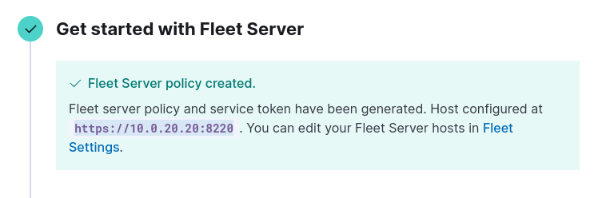
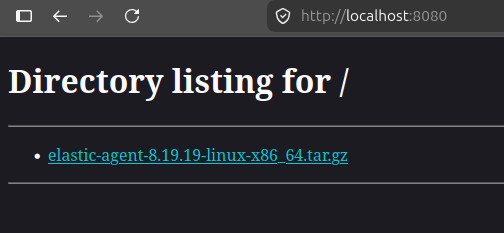
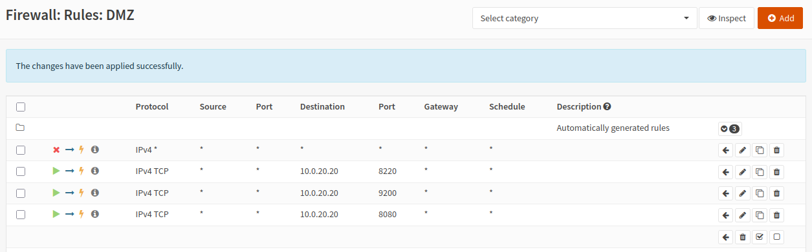

# Homelab Entry #4: Elastic SIEM Installation - IN PROGRESS

## 『 ⭐ Project overview & Key Outcomes 』

### / 💠 Concepts Applied /

### / 🏆 Core Achievements /

## 『 1️⃣ Installing Elastic 』

I completely reinstall my installation of Ubuntu for the Security VM on my homelab to start from a fresh slate. I first download the Elastic PGP key and add the official repository list.

Next, I run `sudo apt install elasticsearch -y` to install Elasticsearch — the first component of the Elastic Stack. I start and enable the service and then continue to the next step, which is installing Kibana. Kibana will serve as the visual layer for the Elastic Stack. I run `sudo apt install kibana -y` and then start the service, and then connect to `http://localhost:5601/` to setup the Kibana dashboard.

[text](<05 - Elastic SIEM Installation.md>)

First of all, I am definitely going to forget the auto-generated password for Kibana (it was a random gibberish string). I run the command to change it to something else I'll be able to remember.

Next, I'll want to use the more modern Elastic Agent to collect logs, which means I will need to initialize the Elastic Fleet. To ensure Elasticsearch stays on the same IP address, I'll set up a static IP mapping to the Analyst VM. I restart the VM and continue with setting up the Elastic Fleet. I set the name and URL of the server to the security VM and move onto the next step.



I install the fleet server onto the security VM, and with that finished I can start enrolling Elastic agents. Looking at the command, I instantly see a problem.

```
curl -L -O https://artifacts.elastic.co/downloads/beats/elastic-agent/elastic-agent-8.19.19-linux-x86_64.tar.gz 
tar xzvf elastic-agent-8.19.19-linux-x86_64.tar.gz
cd elastic-agent-8.19.19-linux-x86_64
sudo ./elastic-agent install --url=https://10.0.20.20:8220 --enrollment-token=######################
```

That first command downloads an archive from the URL `https://artifacts.elastic.co/downloads/beats/elastic-agent/elastic-agent-8.19.19-linux-x86_64.tar.gz `. Unfortunately, my entire homelab is restricted from the internet, so installing this will be impossible. However, I think of a clever alternative. I'll download this archive on my host PC, drop it into the security VM, and then host a python http server for it — Like this:



Before I get the agent installation running, I also need to change my firewall to allow port 8220 and 9200 (and port 8080 temporarily to allow the download of the archive to happen).



Hopefully I set those firewall rules up properly, because now I will run the Elastic Agent install and hope for the best. I'll use this modified command:

```
curl -L -O http://10.0.20.20:8080/elastic-agent-8.19.19-linux-x86_64.tar.gz 
tar xzvf elastic-agent-8.19.19-linux-x86_64.tar.gz
cd elastic-agent-8.19.19-linux-x86_64
sudo ./elastic-agent install --url=https://10.0.20.20:8220 --enrollment-token=######################
```

Andddddd... I've already made a mistake. This command is for Linux endpoints, not Windows. I have no idea how I didn't catch that oversight. 

This is my REAL modified command:

```
$ProgressPreference = 'SilentlyContinue'
Invoke-WebRequest -Uri http://10.0.20.20:8080/elastic-agent-8.19.19-windows-x86_64.zip -OutFile elastic-agent-8.19.19-windows-x86_64.zip 
Expand-Archive .\elastic-agent-8.19.19-windows-x86_64.zip -DestinationPath .
cd elastic-agent-8.19.19-windows-x86_64
.\elastic-agent.exe install --url=https://10.0.20.20:8220 --enrollment-token=######################
```

Once I run the command, the download succeeds but the connection to `10.0.20.20:8080` does not recieve a response and thus the agent enrollment fails. I fix this by allowing the connection in the Ubuntu firewall, but then the enrollment fails for a different reason: The certificate is signed by an unknown authority. Although this isn't the best practice for production environments, I add the `--insecure` flag to the install and retry. After, that the agent is installed fine.


