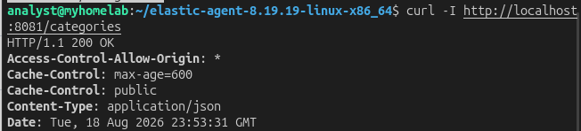
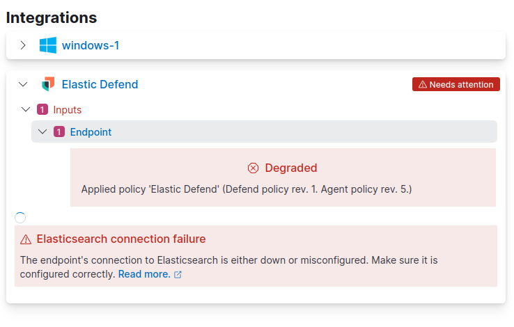
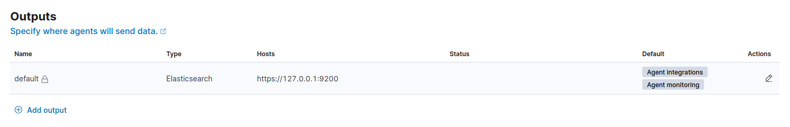
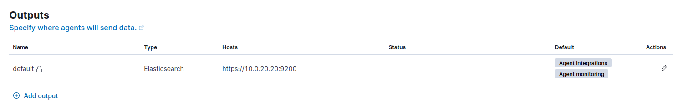
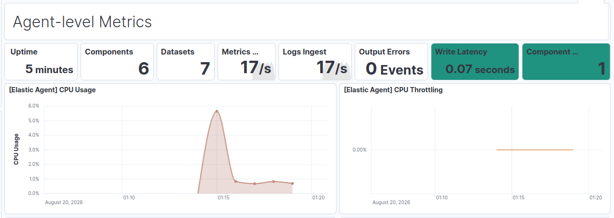

# Homelab Entry #4: Elastic SIEM Installation - IN PROGRESS

## 『 ⭐ Project overview & Key Outcomes 』

### / 💠 Concepts Applied /

### / 🏆 Core Achievements /

## 『 1️⃣ Installing Elastic 』

I completely reinstall my installation of Ubuntu for the Security VM on my homelab to start from a fresh slate. I first download the Elastic PGP key and add the official repository list.

Next, I run `sudo apt install elasticsearch -y` to install Elasticsearch — the first component of the Elastic Stack. I start and enable the service and then continue to the next step, which is installing Kibana. Kibana will serve as the visual layer for the Elastic Stack. I run `sudo apt install kibana -y` and then start the service, and then connect to `http://localhost:5601/` to setup the Kibana dashboard.

[text](<05 - Elastic SIEM Installation.md>)

First of all, I am definitely going to forget the auto-generated password for Kibana (it was a random gibberish string). I run the command to change it to something else I'll be able to remember.

Next, I'll want to use the more modern Elastic Agent to collect logs, which means I will need to initialize the Elastic Fleet. To ensure Elasticsearch stays on the same IP address, I'll set up a static IP mapping to the Analyst VM. I restart the VM and continue with setting up the Elastic Fleet. I set the name and URL of the server to the security VM and move onto the next step.


I install the fleet server onto the security VM, and with that finished I can start enrolling Elastic agents. Looking at the command, I instantly see a problem.

```
curl -L -O https://artifacts.elastic.co/downloads/beats/elastic-agent/elastic-agent-8.19.19-linux-x86_64.tar.gz 
tar xzvf elastic-agent-8.19.19-linux-x86_64.tar.gz
cd elastic-agent-8.19.19-linux-x86_64
sudo ./elastic-agent install --url=https://10.0.20.20:8220 --enrollment-token=######################
```

That first command downloads an archive from the URL `https://artifacts.elastic.co/downloads/beats/elastic-agent/elastic-agent-8.19.19-linux-x86_64.tar.gz `. Unfortunately, my entire homelab is restricted from the internet, so installing this will be impossible. However, I think of a clever alternative. I'll download this archive on my host PC, drop it into the security VM, and then host a python http server for it — Like this:


Before I get the agent installation running, I also need to change my firewall to allow port 8220 and 9200 (and port 8080 temporarily to allow the download of the archive to happen).


Hopefully I set those firewall rules up properly, because now I will run the Elastic Agent install and hope for the best. I'll use this modified command:

```
curl -L -O http://10.0.20.20:8080/elastic-agent-8.19.19-linux-x86_64.tar.gz 
tar xzvf elastic-agent-8.19.19-linux-x86_64.tar.gz
cd elastic-agent-8.19.19-linux-x86_64
sudo ./elastic-agent install --url=https://10.0.20.20:8220 --enrollment-token=######################
```

Andddddd... I've already made a mistake. This command is for Linux endpoints, not Windows. I have no idea how I didn't catch that oversight. 

This is my REAL modified command:

```
$ProgressPreference = 'SilentlyContinue'
Invoke-WebRequest -Uri http://10.0.20.20:8080/elastic-agent-8.19.19-windows-x86_64.zip -OutFile elastic-agent-8.19.19-windows-x86_64.zip 
Expand-Archive .\elastic-agent-8.19.19-windows-x86_64.zip -DestinationPath .
cd elastic-agent-8.19.19-windows-x86_64
.\elastic-agent.exe install --url=https://10.0.20.20:8220 --enrollment-token=######################
```

Once I run the command, the download succeeds but the connection to `10.0.20.20:8080` does not recieve a response and thus the agent enrollment fails. I fix this by allowing the connection in the Ubuntu firewall, but then the enrollment fails for a different reason: The certificate is signed by an unknown authority. Although this isn't the best practice for production environments, I add the `--insecure` flag to the install and retry. After, that the agent is installed fine.


Next, I'll configure some stuff that I should've done earlier.
First, I'll give Elasticsearch 8 gigabytes of RAM. I create the file `/etc/elasticsearch/jvm.options.d/heap.options` and write these two lines below:

```
-Xms8g
-Xmx8g
```

Afterwards, I restart the Elasticsearch service. Next, as this homelab is essentially an airgapped environment, I need to point Kibana to the registry where it will download integrations and also that the homelab is airgapped. Inside of `/etc/kibana/kibana.yml`, I put these lines and then restart Kibana:

```
xpack.encryptedSavedObjects.encryptionKey: "[redacted]"
xpack.fleet.registryUrl: "http://localhost:8081"
xpack.fleet.isAirGapped: true
```

Now that I've configured Kibana to run in an airgapped environment, I need to host the Elastic Package Registry on my network. Luckily, Elastic provides a pre-built docker image for this. That means I'll have to install Docker first. After installing it and downloading the Elastic Package Registry, I am now ready to install integrations on my Elastic Fleet Agents.

Sysmon is installed on the Juice Shop webserver, and I'll want to ingest those logs. I'll also need to ingest the webserver logs. For Sysmon, I can utilize the Windows integration.  Just to verify nothing is broken, I check the agent is working properly, and it appears that it is. I also make sure the Elastic Package Registry is working on docker.




The System and Windows integrations are already installed, but I would also like to install the Elastic Defend Integration.


I simply add Elastic Defend from the integrations tab, and after it's done installing I check up on my agent to see if it went smoothly. Unfortunately, the agent reports "Unhealthy" as its status, meaning something has gone wrong. It appears that Elastic Defend is unable to connect to Elasticsearch.



First, I'll check if any packets are getting blocked by the firewall. According to OPNSense, it is not blocking any packets. Next, I checked the Fleet settings, and identified the main problem. I incorrectly set up the output host as `127.0.0.1` — localhost — instead of the real internal IP address, which was `10.0.20.20`.



I fixed this by editing `kibana.yml` and then restarting both Kibana and the Elastic Agent on the endpoint.



After applying the fix, the agent is up and healthy! Awesome! The agent metrics are also appearing correctly!




Let's also see if Sysmon is also getting ingested properly. I will open the Voice Recorder app on Windows and then check if the SIEM ingests it. As expected, the event is logged and I am able to filter for it. And with that, I have finished setting up the essential configurations for the Elastic Stack.

Oh yeah, and I DID, in fact, remember to remove the firewall allow rule for port 8080. See? I am very responsible. :>
