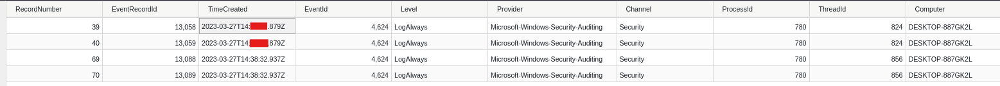
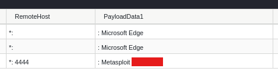
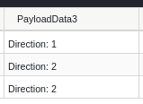
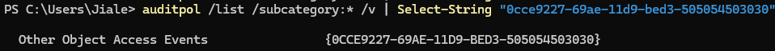
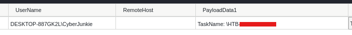
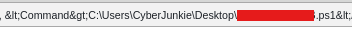
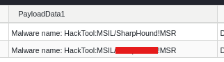
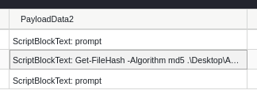
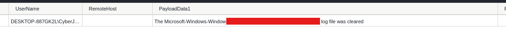

**Completion date:** 2026-07-23\
**Platform:** HackTheBox, [https://app.hackthebox.com/sherlocks/LogJammer]\
**Skills and Tools Used:** EvtxECmd, Tad, Windows Event Logs

## Overview
### TL;DR
(DISCLAIMER: SUMMARY IS GENERATED BY AI -- HUMAN EDITED & REVIEWED FOR ACCURACY. THIS IS THE ONLY PART OF THIS DOCUMENT GENERATED WITH AI)

#### 🎯 Executive Summary: DFIR Windows Event Log Analysis

Completed a HackTheBox sherlock simulating a real-world Digital Forensics & Incident Response (DFIR) investigation. Conducted deep-dive analysis into Windows Event Logs, tracking an insider threat / unauthorized activity lifecycle from initial login to defense evasion.

#### 🔑 Key Technical Skills Demonstrated

* **Log Parsing & Tools:** Parsed raw `.evtx` event logs efficiently using **EvtxECmd**.
* **Log Filtering & Time-Lining:** Narrowed hundreds of log entries down to critical artifacts by correlation across specific timeframes and Event IDs.
* **Cross-Log Correlation:** Analyzed Security, Firewall, Defender, PowerShell, and System logs to piece together a unified incident timeline.

##### 🛠 Investigation Highlights & Event IDs

| Artifact / Phase | Key Event ID(s) | Key Accomplishments & Methodology |
| :--- | :--- | :--- |
| **Authentication** | `4624` (Security) | Filtered interactive logons (**Logon Type 2**) to pinpoint the exact time the user first logged in. |
| **Firewall Modification** | `2004` (Firewall) | Correlated timeline to identify an unauthorized outbound rule created for Metasploit (Port 4444). |
| **Audit Policy Tampering** | `4719` (Security) | Mapped raw subpolicy GUIDs to identify unauthorized audit policy changes. |
| **Persistence** | `4698` (Security) | Located a newly scheduled task, extracted execution paths, and analyzed PowerShell arguments. |
| **Antivirus / Threat Detection** | `1117` (Defender) | Analyzed Defender logs to identify flagged malware binaries, original execution paths, and remediation actions taken. |
| **Execution Analysis** | `4104` (PowerShell) | Inspected Script Block Logging to uncover exact PowerShell commands executed by the threat actor. |
| **Defense Evasion / Anti-Forensics** | `104` (System) | Identified evidence of log clearing targeting specific system event logs. |

---

> **Summary Takeaway for Hiring Managers:** Demonstrates a practical, methodical approach to triage and forensic analysis—efficiently sifting through high-volume event logs to identify IOCs, persistence mechanisms, and defense evasion techniques.

### Post-Investigation Summary:
An insider threat logged into their workstation at `27/03/2023 14:##:## UDT` and proceeded to permit a metasploit C2 connection via the firewall. They then tampered with an audit policy `##############` to hinder logging capabilities of the system. The threat then created a scheduled task to automate execution of a powershell file found on the user's desktop. Additionally, the threat attempted to import an Active Directory enumeration tool -- SharpHound -- but was blocked by the antivirus. Finally, the threat took an MD5 hash of the aforementioned powershell file and proceeded to clear the endpoint's firewall logs.

### From HackTheBox:
You have been presented with the opportunity to work as a junior DFIR consultant for a big consultancy. However, they have provided a technical assessment for you to complete. The consultancy Forela-Security would like to gauge your knowledge of Windows Event Log Analysis. Please analyse and report back on the questions they have asked.

## Methodology and Thinking

### Q1: When did the cyberjunkie user first successfully log into his computer? (UTC)
Seems like we only have Windows event logs. I'll first parse all of them with EvtxECmd. For sign-in events, I'm looking for event ID 4624 in the security logs. There are 67 logon event, but we want to find the time the user first successfully logged onto his computer. There are three different logon types visible:
- Logon Type 0 - Used exclusively by the `SYSTEM` account and is of no interest
- Logon Type 2 - Interactive logons on the physical keyboard
- Logon Type 5 - A windows service logon

Logon type 2 is the most relevant. I filter the event logs again to target only the user `CyberJunkie`. This narrows the 115 total rows in the parsed event log to just 4 rows.

The first row will be the user's first logon attempt, which is the answer we are looking for.

### Q2: The user tampered with firewall settings on the system. Analyze the firewall event logs to find out the Name of the firewall rule added?
We can use the Windows Firewall event logs for this. We are looking primarily for event ID 2004. Unfortunately, that only trims the 929 row spreadsheet to 490 rows. In that case, I can trim the logs even more by filtering it to our investigation's relevant timeframe. I filter the TimeCreated column to show only stuff after the first logon time, and this works brilliantly as it cuts our 490 rows to just three. The first two are fairly benign, but the second one is alarming to to its mention of Metasploit and the allow rule for port 4444 -- a common metasploit port.

Here, we are able to get our answer.

### Q3: Whats the direction of the firewall rule?

We can find the answer to this in the same exact spot as the previous question -- we just have to scroll to the right a bit. It appears that the malicious firewall rule is set to direction 2. With a quick Google search, I find out that direction 2 stands for outbound traffic, whilst direction 1 stands for inbound traffic.

### Q4: The user changed audit policy of the computer. Whats the Subcategory of this changed policy?
Audit policy changes are under event ID 4719. Filtering for it thankfully returns only 1 row, but the biggest problem is that the row returns the ID of the subpolicy, not its actual name. Luckily, these IDs and GUIDs stay the same across computers, so I simply searched for the audit policy on my own computer and filtered for that specific GUID. Surprisingly worked out perfectly.

### Q5: The user "cyberjunkie" created a scheduled task. Whats the name of this task?
Now, we don't have task scheduler operational logs, but we do have the security logs, which is all we need. I filter for event ID 4698 in the security logs, which returns only one row, meaning that we don't have to do any more filtering.

### Q6: Whats the full path of the file which was scheduled for the task?
This is visible in the same row -- one of the columns displays the contents of the scheduled task, where it runs a powershell file in the user's desktop.

### Q7: What are the arguments of the command?
We can see this right after the command that excecutes the powershell file.

### Q8: The antivirus running on the system identified a threat and performed actions on it. Which tool was identified as malware by antivirus?
This should be fairly straightforward as we were given the Window's defender logs. The event ID for action taken to protect the system is 1117, so that is what I filter for. However, we will still need to filter down further as we still have 71 more rows to deal with. I use the time trick from earlier to search for only the relevant logs in the time period, and it works like a charm. The 444 line log is cut down to just 2 events, both seeming to be virtually identical. Here, I get my answer.

### Q9: Whats the full path of the malware which raised the alert?
Scrolling to the right a bit, I can view the ExecutableInfo column which details exactly where the file came from and its path. Pretty straightforward.

### Q10: What action was taken by the antivirus?
Same row, just in a different spot. Straightforward again.

### Q11: The user used Powershell to execute commands. What command was executed by the user?
Seems like we have to move onto Powershell logs. First of all, I instantly filter the time so that I only view relevant logs, which trims down the events from 578 rows to just 20. Next, I filter for event ID 4104, which trims down the logs even more to just three events. Our answer becomes clear after this.

### Q12: We suspect the user deleted some event logs. Which Event log file was cleared?
The event ID for event log cleared is 104 in the system log. After filtering to the relevant timeframe, only one log remains which easily gives us our answer. And with that, the sherlock is complete.

