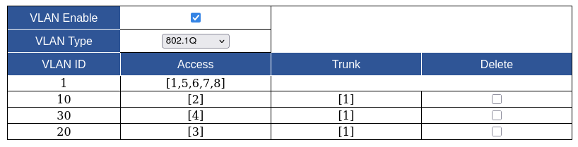
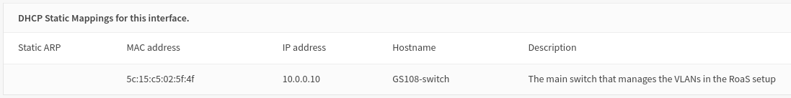
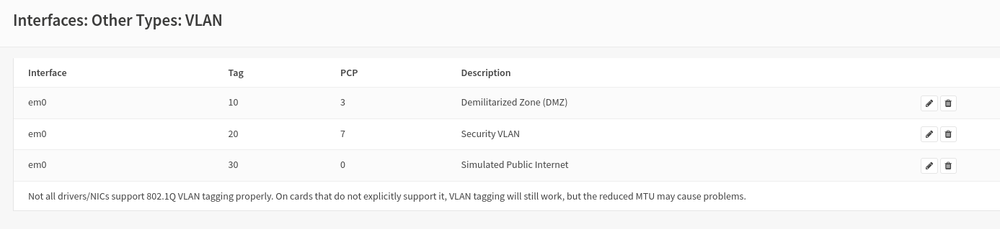
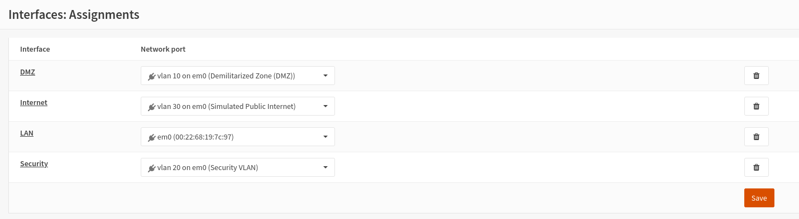
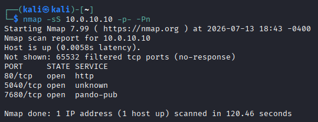
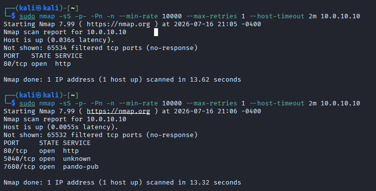

# Homelab Entry #4: Network Revamp & Router-on-a-Stick Architecture Implementation

## -// ⭐ Project overview & Key Outcomes //-

In order to secure my Homelab network and better match an enterprise network, I rearchitected my homelab network to move away from a single flat subnet and instead utilize a multi-VLAN Router-on-a-Stick configuration.

### / 💠 Concepts Applied /
- VLAN segmentation and subnets with 802.1Q VLAN Tagging
- Firewall floating rules on OPNSense
- Network setup for Virtual Machines (on Virtualbox)
- Firewall testing and validation (via Nmap)

### / 🏆 Core Achievements /
- Properly implemented the Router-on-a-Stick networking configuration on my Homelab
- Designed and configured three VLANs (DMZ, Security, and a simulated WAN)
- Verified success of firewall implementation via Nmap port scans

## -// 1️⃣ Major Network Revamp and Router-on-a-Stick (RoaS) setup //-

Coming back to this homelab, I realized I needed a serious revamp of the network. The biggest change I wanted to do was to use VLANs to create a DMZ for the Juice Shop webapp.

Unfortunately, my repurposed laptop that has been turned into a router only has one single ethernet port. In order to be able to use VLANs, my best bet was to revamp my network architecture to be a Router on a Stick (RoaS). Thus, I had to purchase a managed switch. I found one off of Amazon for 16 bucks, and in the meantime, I drew up the architecture in Google Drawings.

It is fairly simple. At the very top, I have the OPNSense router trunked to the managed switch. This switch will manage three VLANs:
- A demilitarized zone. This is where "public" facing endpoints go, such as the Juice Shop webapp.
- A security VLAN. This is where endpoints used for security purposes will typically go, like my Security VM used to ingest logs from the Elastic Stack.
- A simulated internet. The Juice Shop won't actually be exposed to the public-facing internet, so this VLAN will be treated with a firewall built as if it was from the public-facing internet.

My desktop will host two different VMs: The attacker VM and the security VM. Due to limitations with the amount of Ethernet ports I have, I will need to trunk the two VMs into the same port on my Managed Switch and use tagging.

The full drawing of the network architecture can be seen below:

So, now its time to set it up for real. First off, I realized that I completely forgot to put my router (the one that has been repurposed into an access point + unmanaged switch) into AP mode. Now that it is setup into AP mode, I connect all the required ethernet cables to their corresponding ports.

Additionally, after turning on my router again, I realized I've made a pretty big mistake with my OPNSense configuration. The only interface I have configured is the WAN interface, so for the entire time my homelab network has been treated as the public-facing internet. Oops. This mistake stems from me thinking that WAN meant for wireless, meaning that if I used a WAP then I would have to use the WAN interface. However, now I know the difference between the two, and now I have to reconfigure my OPNSense. So let's get started on that.

While I am doing this, I am also going to change my homelab's subnet from `192.168.1.x` to `10.0.0.x`. This makes my homelab network not interfere too much with my regular home network.

## -// 2️⃣ VLAN Configuration //-

Next, I will want to configure the VLANs for my network. These VLANs were the primary reason I purchased this switch. I'll have to do some configuration in three places: the switch's web management portal, my virtual machine, and the OPNSense router.

I first configure my VLANs on the switch. I need three VLANs, so I put them in ID 10, 20, and 30 -- these are the DMZ, Security, and Simulated Internet VLANs respectively. The DMZ is only to one single endpoint, so I can simply set port 3 as an access port. Port 1 goes straight into the router, and because this network runs the Router-on-a-Stick architecture, it must be a trunk port. Port 2 is also a trunk, as two different virtual machines are conneecting to it via one single port. You can see the configuration below.

Now for the VirtualBox. Unfortunately, it turns out that VirtualBox does not support VLAN tagging and trunking on Windows hosts, and I cannot user Hyper-V due to being on Windows 11 Home. However, I have uncovered a stroke of luck as the USB to Ethernet dongle has a Realtek NIC, meaning that I can use their ethernet diagnostic tool to make VLANs there. I download their tool and create two virtual adapters.

However, VirtualBox does not list the drivers in the dropdown when I use bridged adapter, and installing the VirtualBox NDIS6 Bridged Networking Driver fails. Now, I could do more diagnosing to figure out what exact is the problem and why I can't install the driver, but instead I opt to just plug in two ethernet cables into my computer and put them on two different ports on the switch. Thus, this would be my new image of my network architecture. The difference is that there are now two different cables going into the switch intead of just one. Port 2 is no longer a Trunk Port.

*Note: A few days later, I chose to make the port order be this: [Router], [VLAN 10], [VLAN 20], [VLAN 30] to make keeping track of stuff easier.*

This also means that my VLAN setup needs to be different.

Next, I need to configure the VLANs on OPNSense. First of all, before I even do that, my switch takes the static IP address `10.0.0.10`, but OPNSense assigns it `10.0.0.20` anyways, so it is best for me to assign a static mapping for it to `10.0.0.10`. 

Next, the actual VLAN setup. I'll let nothing except the security VM access the switch and OPNSense configuration, as it is the only device that makes any sense to allow access. I specify the three VLANs and dictate their priorities, with the security VLAN at the top, followed by the Juice shop and then the simulated public internet at the very bottom. Additionally, I learned that when specifying VLAN priority, "Best Effort (PCP 0)" does not get the best effort, and that "Excellent Effort (PCP 2)" gets better effort. When did the best effort not be the best effort? I don't know. Here's the config below:

With `ifconfig`, I can verify that the subnetting works too. (`10.0.30.x` is the subnet for the simulated internet)

## -// 3️⃣ DMZ & Fake Internet Firewall configuration //-
So the game plan is essentially this: The Juice Shop will only allow two-way traffic between HTTP port 80, where the webapp is hosted on. Later, I will add a second rule allowing only outbound traffic into the SIEM. I will fix up the SIEM setup after I finish up everything else with the network.

In OPNSense, I first set a static IP address to the Juice Shop -- `10.0.10.10`. Next, I create an `in` rule that allows every TCP connection on port 80 to the IP address `10.0.10.10`.

[text](<04 - Network Revamp.md>)
 
To verify if this firewall rule works as intended, I first disable the firewall rule and run an Nmap port scan for all 65535 ports. It seems that after passing through the host-based firewall, three ports are accessible -- port 80, 5040, and 7680. Now, I will turn on the firewall rule. I should except Nmap to only find port 80 now. Unfortunately, the same three ports are still accessible, meaning that I probably made a mistake in my firewall rule.

This is where I learn that OPNSense's firewall rules only process traffic in the ingress direction. Thus, I should create a **floating** rule instead. This will let me apply the rule to multiple interfaces. I also make another rule on the fake internet VLAN for good measure, and I also make a rule to keep the router management portal accessible for the meantime. Now, it is time to retest the firewall with Nmap.

When the scan was running though, I saw my ethernet cable's light blink rapidly, and it got me curious to see what was going on. So, I looked at the firewall logs and instantly got bombarded with a flood of traffic. I could see my device send thousands of packets to every single port on the Juice Shop, and it really put into perspective just how loud my Nmap scan was.

Once the scan was finished, the only port that appeared was port 80. However, I got a bit suspicious as if the other two ports I saw before were filtered by the firewall, Nmap should report "Filtered" instead of hiding the port. This got me wondering if the two other ports were still active. Thus, I will turn off the firewall and run another nmap scan without restarting any devices.

After rerunning the scan, it seems that our firewall does indeed work as intended. Maybe it was just the options I put in Nmap, but I reran the scans a few times and got the same results (UPDATE - NMAP KNEW THE PORTS WERE FILTERED, BUT EVEN CLOSED PORTS WERE FILTERED SO NMAP CHOSE TO HIDE ALL OF THEM). Additionally, after turning off the temporary allow rule I set earlier, I was unable to connect to any other endpoint other than the Juice Shop.

For our final step, I want to explicitly block all packets going out of the Juice Shop. This should be fairly simple, as I just make a block rule that covers everything. Due to first match being enabled, if my floating rule is triggered then this block rule will not be triggered. That sums up the firewall setup for the DMZ. The rest should be simpler.

## -// 4️⃣ Firewall Testing //-

Now, finally one last test to make sure everything is running smoothly. I will make a list for what the firewall should be doing for each endpoint and what it actually does.

### / My Kali Linux VM (On the fake internet) /
My Kali Linux VM should:
- Be able to access port 80 of the Juice Shop, which is on `10.0.10.10`
- not be able to access any other endpoint

My Kali Linux VM:
- Cannot communicate to `10.0.0.10` at all
- Cannot communicate to `10.0.0.1` at all
- Can communicate to only port 80 of `10.0.10.10`

Everything lines up nicely.

### / My Security VM (On the Security VLAN) /
My Security VM should:
- Be able to communicate with the Juice Shop
- Be able to communicate with the OPNSense management portal
- Be able to communicate with the Switch management portal

My Security VM:
- Is able to connect to the Juice Shop
- **Cannot** communicate to the OPNSense management portal
- **Cannot** communicate to the Switch management portal

Everything is not lining up nicely. I need to review my firewall rules. After reviewing the firewall rules, nothing instantly looks wrong. The configuration seems like it works -- but it isn't. Once I checked my assigned subnet though, I found out that it was the same as my attacker VM and I realized that I was using both ethernet cables instead of just one. After fixing that problem, I reevaluated what I could connect to and everything seemed to finally work well.

My Security VM (after fixes):
- Is able to connect to the Juice Shop
- **Can** communicate to the OPNSense management portal
- **Can** communicate to the Switch management portal

### / Juice Shop (On the DMZ) /

The Juice Shop should:
- Be able to communicate with NOTHING except return requests from the internet on port 80

The Juice Shop:
- Indeed, cannot communicate with anything except return requests from the internet on port 80.

Everything lines up smoothly, and thus, this section of my homelab is complete. I have set up a full homelab network using the Router-on-a-Stick architecture, and have setup multiple VLANs with properly configured firewall rules.
