# THM CTF: Secret Recipe

**Completion date**: 10/2/2025\
**Platform:** TryHackMe, [https://tryhackme.com/room/registry4n6]\
**Skills and Tools Used:** Registry Forensics on Windows, Mark Zimmerman's EZTools

## Preface
An IT guy is suspected to have stolen a top secret coffee recipe and downloaded it on their computer. Using registry forensics, the goal here is to examine the computer

### Q1: What is the computer name of the machine found in the registry?

Using the provided registry cheatsheet, I go to `SYSTEM\CurrentControlSet\Control\ComputerName\ComputerName`. Here, I get my answer.

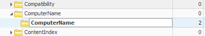

### Q2: When was the Administrator account created on this machine?

I go to `SAM\Domains\Account\Users`. Important information about users such as ID and name are stored here. 

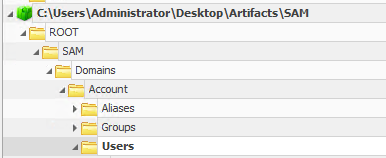
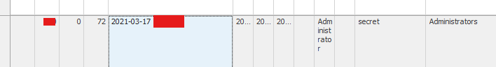

### Q3: What is the RID associated with the Administrator account?

Like before, important information about users are store in `SAM\Domains\Account\Users`. Looking at the row with the username "Administrator", I retrieved my answer from the User ID column. 

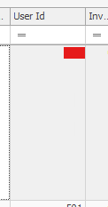

### Q4: How many user accounts were observed on this machine?
Inside the Users folder, a list of all the account's hexadecimal ID is shown. The zeros at the beginning is padding, so if we convert the hex `1F4` to decimal, we get ID `500`, which is the administrator account. Anyways, I count the values inside the folder and get my answer.

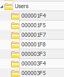

### Q5: There seems to be a suspicious account created as a backdoor with RID 1013. What is the account name?

Looking in the `Names` folder right under the `Users` folder, The names of accounts are listed instead of their ID. 

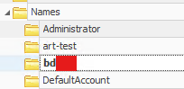

### Q6+7: What is the VPN connection this host connected to? When was the first VPN connection observed?

I needed a hint for this one, but it told me to look inside NetworkList, and here I found both answers.

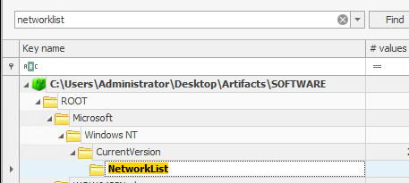

### Q8: There were three shared folders observed on his machine. What is the path of the third share?

Using a quick google search, I learned that network shares and stuff are stored at `SYSTEM\CurrentControlSet\Services\LanmanServer\Shares`. Here I got my answer

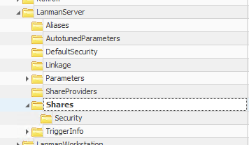

### Q9: What is the last DHCP IP assigned to this host?
I checked network interfaces and past networks located at `SYSTEM\CurrentControlSet\Services\Tcpip\Parameters\Interfaces`.

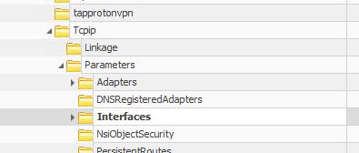

### Q10: The suspect seems to have accessed a file containing the secret coffee recipe. What is the name of the file?

I looked at `NTUSER.DAT\Software\Microsoft\Windows\CurrentVersion\Explorer\RecentDocs` as this registry key stores recent files.
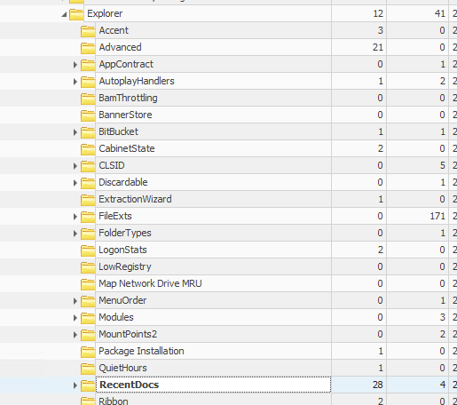

### Q11: The suspect executed multiple commands using the Run window. What command was used to enumerate the network interfaces?

Up until now I forgot that there was a search box. So from here on out, I mostly just searched for all of the registry keys. For this question, there is a registry key called `runmru` which stores recently run commands in the run box.

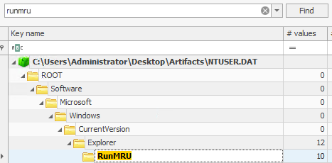

### Q12: The user searched for a network utility tool to transfer files using the file explorer. What is the name of that tool?

The WordWheelQuery registry key usually stores search queries in the file explorer. I identified network tool in question immediately, as I have used it for reverse shells in offensive security CTFs.

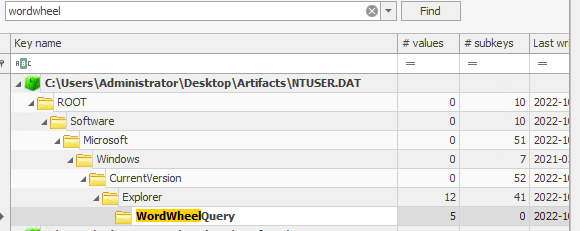
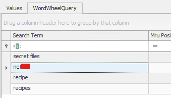

### Q13: What is the recent text file opened by the suspect?

Seems like we're going back to RecentDocs

### Q14: How many times was PowerShell executed on this host?

Appcompatcache (SYSTEM\CurrentControlSet\Control\Session Manager\AppCompatCache) stores good evidence of execution, so I went there first. From there, I searched up "Powershell"

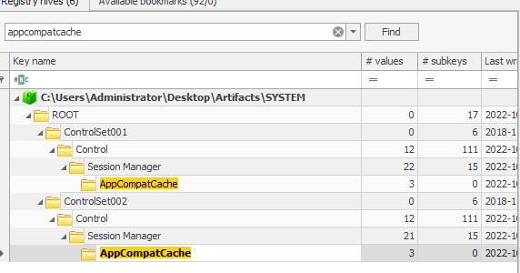
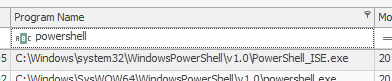
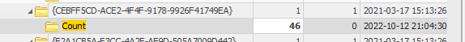

### Q15: The suspect also executed a network monitoring tool. What is the name of the tool? For how many seconds was ProtonVPN executed? What is the full path from which everything.exe was executed?

Although Appcompatcache would probably have this, I found it to have too many events for me to look through. I decided to use the UserAssist registry key instead. Here I found my answers.

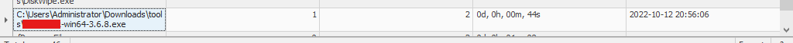
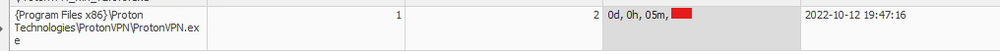
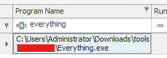
