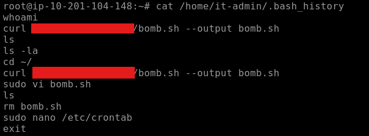
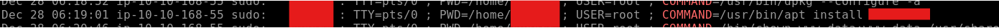
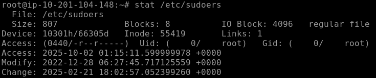
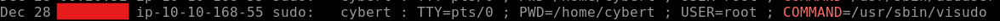
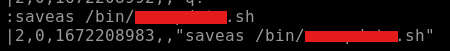
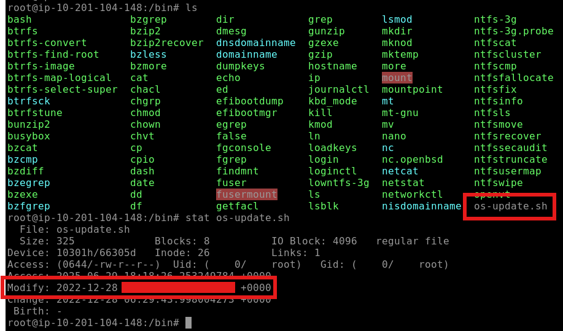
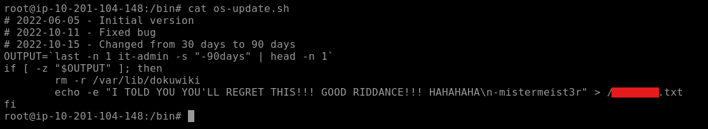
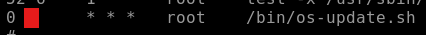

# THM CTF: Disgruntled

**Completion date**: 10/1/2025\
**Platform:** TryHackMe, [https://tryhackme.com/room/disgruntled]\
**Skills and Tools Used:** Digital Forensics on Linux

## Preface
The goal here is to investigate if an arrested IT guy has done anything rogue on company assets.

### T3, Q1+2: The user installed a package on the machine using elevated privileges. According to the logs, what is the full COMMAND? What was the present working directory (PWD)?

First, I took a look at bash history, but unfortunately, I do not see anything useful, other than something called `bomb.sh`. I note this file down as it seems important.

Next, I checked `auth.logs`, as security events are stored there. What I'm looking for are commands executed by sudo. I `grep` for the keyword "COMMAND" to filter for well, specifically commands, and locate the installed package in question, and find the working directory.

### T4, Q1: Which user was created after the package from the previous task was installed?

Looking further down `auth.log`, I found a command containing the word "adduser"

### T4, Q2: A user was then later given sudo priveleges. When was the sudoers file updated?

I first tried to use the `stat` command on the sudoers file, as that would give me information on when it was last modified. Unfortunately, the answer I got here was incorrect. I had to use the hint, which led me back to the auth logs to a command `visudo`, where I got my answer.

### T4, Q3: A script file was opened using the "vi" text editor. What is the name of this file?

I remembered the bash logs, where I noted down `bomb.sh`. Seems useful here.

### T5, Q1: What is the command used that created the file bomb.sh?

This was found in the bash logs, just like the previous question.

### T5, Q2: The file was renamed and moved to a different directory. What is the full path of this file now?

I couldn't find this in the bash logs nor the auth logs. After using the hint which led me to the vi logs, I found the target file and command.

### T5, Q3: When was the file from the previous question last modified?

I navigated to the directory the malicious file was in, and used `stat` to see the last modified date.

### T5, Q4: What is the name of the file that will get created when the file from the first question executes?

I used the `cat` command to see what the malicious file has contained. I see a command with the `>` redirector, signifying it creates a file. Here, I found my answer.

### T6, Q1: At what time will the malicious file trigger?

I needed the hint for this one, but after going to cronjobs, I found the malicious file and when it would run. 

