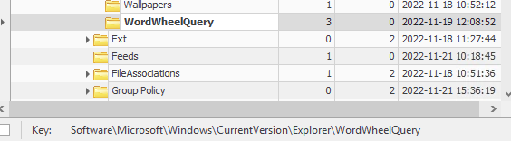
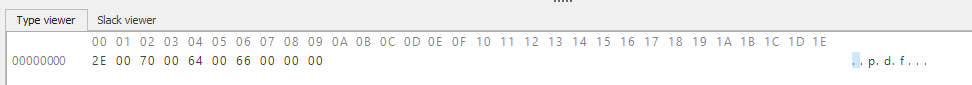
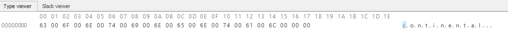
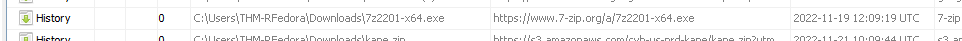
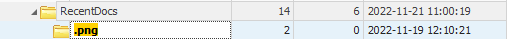
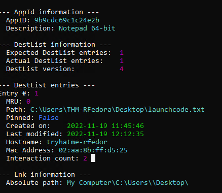

# THM CTF: Unattended

**Completion date**: 10/1/2025\
**Platform:** TryHackMe, [https://tryhackme.com/room/unattended]\
**Skills and Tools Used:** Digital Forensics using Eric Zimmerman's EZTools

## Preface
The goal here is to investigate what a malicious actor did when tampering with an employee's physical computer

### T3, Q1: What file type was searched for using the search bar in Windows Explorer?

The registry key, "WordWheelQuery" stores searches in the file explorer. With this information, I am able to see the searched filetype

### T3, Q2: What top-secret keyword was searched for using the search bar in Windows Explorer?

This is found in the same registry key as the previous question.

### T4, Q1+2: What is the name of the downloaded file to the Downloads and at what time was it downloaded?

For this question, I decided to use Autopsy. Looking at the download history, I found the file in question

### T4, Q3: Thanks to the previously downloaded file, a PNG file was opened. When was this file opened? 

A registry key called RecentDocs stores information of, well, recent documents. I found my answer there.

### T5, Q1+2: A text file was created in the Desktop folder. How many times was this file opened? When was it last modified?

I needed the hint for this one, which told me I should look use JLECmd to view windows Jump Lists, which store recently used files and stuff. Here, I got my answer.

### T5, Q3+4: The contents of the file were exfiltrated to pastebin.com. What is the generated URL of the exfiltrated data? What was the string copide to the Pastebin URL?

I decided to take a look at web browsing history with Autopsy, and here, I got my answer.

