# THM CTF: Investigating With Splunk

**Completion date**: 9/20/2025\
**Platform:** TryHackMe, [https://tryhackme.com/room/investigatingwithsplunk]\
**Skills and Tools Used:** Splunk, Cyberchef

## Preface
The goal here is to investigate anomalous activity on a Windows endpoint.

## Q1: How many events were collected and Ingested in the index main?
This one was fairly simple. I filtered for the target index and got the answer I needed.

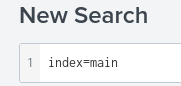

## Q2: On one of the infected hosts, the adversary was successful in creating a backdoor user. What is the new username?
I searched for event ID 4720, as it is the ID for user creation. There, I saw the creation of a new, suspicious account.

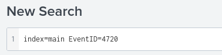
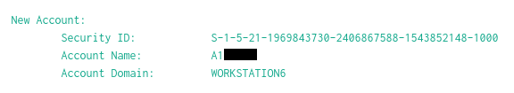

## Q3: On the same host, a registry key was also updated regarding the new backdoor user. What is the full path of that registry key?

I searched for Sysmon event ID 13 (registryEvent) and for the backdoor user.

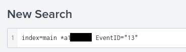

## Q4: Examine the logs and identify the user that the adversary was trying to impersonate.
The `I` in the username has been replaced with a one, so I assumed the username before the swap was the answer.

## Q5: What is the command used to add a backdoor user from a remote computer?
I looked through the "CommandLine" field to see all unique commands executed, and found the command used.

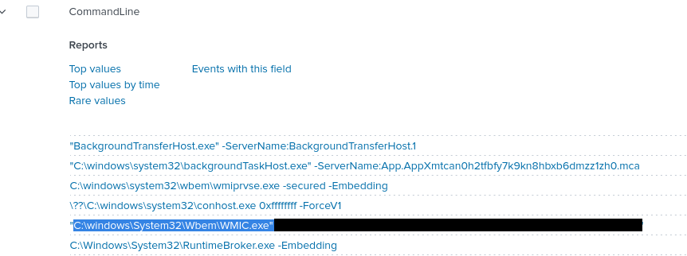

## Q6: How many times was the login attempt from the backdoor user observed during the investigation?
This one was tricky for me, as I tried searching for remote connections, keywords, and security events, but found nothing. After 30 minutes, I gave up and, out of spite, put zero in the answer box. Turns out it was right...

## Q7: What is the name of the infected host on which suspicious PowerShell commands were executed?
I searched for the keyword "PowerShell" and then reviewed the list of hosts.

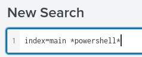
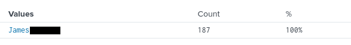

## Q8: PowerShell logging is enabled on this device. How many events were logged for the malicious PowerShell execution?
For this question, I made a search query.

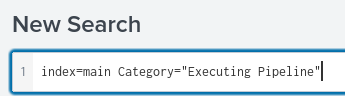

## Q9: An encoded PowerShell script from the infected host initiated a web request. What is the full URL?
I spotted a really long string of characters and assumed it was encoded text. Recognizing Base64, I used CyberChef to decode the string of characters. I then had to remove null bytes and decode a second Base64-encoded string, which returned a URL. I again used CyberChef to defang it.

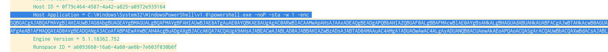
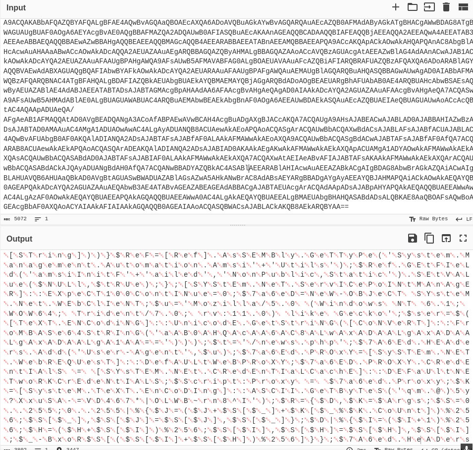
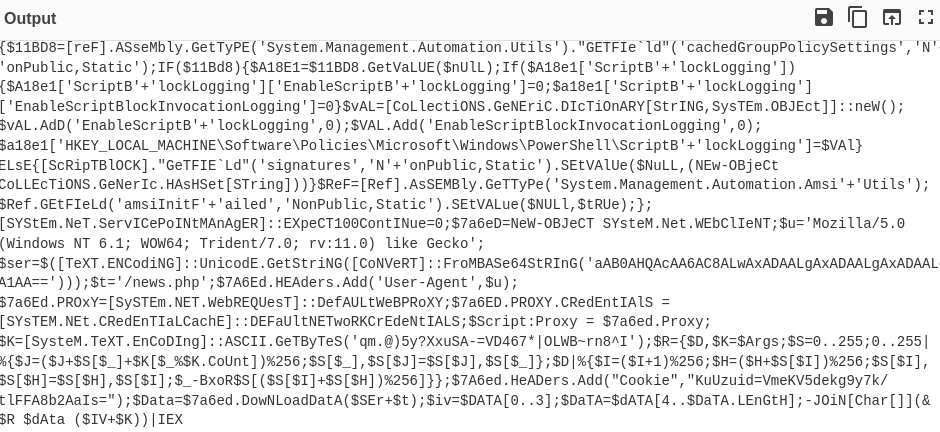
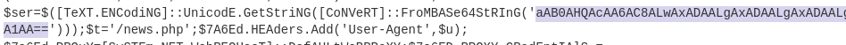
