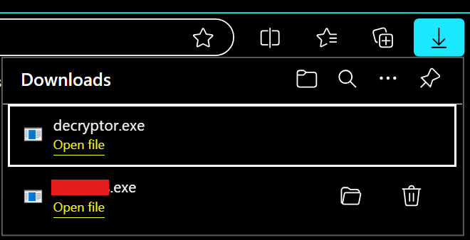

# THM CTF: Retracted

**Completion date**: 9/16/2025\
**Platform:** TryHackMe, [https://tryhackme.com/room/retracted]\
**Skills and Tools Used:** Windows Event Viewer, Digital Forensics

## Preface
In this CTF, your mom downloads a malicious "antivirus" that turns out to be ransomware. When she comes back to check her computer a second time, she finds that everything has been fixed.

## Task 2: The Message
Upon starting up the machine, I noticed an atrocious-looking desktop, but aside from that, I saw a text file on the desktop designated for Sophie (Mom). Assuming this was the message, I used file explorer to get the full path for the message, and answer question one, ***What is the full path of the text file containing the "message"?***. For the second question, ***What program was used to create the text file?***, I guessed notepad, as it is commonly used to create *.txt files. For the final question in task 2, ***What is the time of execution of the process that created the text file?***, I had to check Event Viewer. I reviewed the Sysmon logs and searched for any events with Event ID 11 that contain the keyword "SOPHIE.txt". After finding the event I needed, I answered the question and moved on to task 3.

## Task 3: Something Wrong
To answer question 1, I need to find the location where the malicious file was downloaded. The first spot I checked was the web browser, as it usually stores information on downloaded files. Luckily, the malicious file was indeed logged there, allowing me to answer the first question and the second question (File name and Download Location).

For question 3, ***The installer encrypts files and then adds a file extension to the end of the file name. What is this file extension?***. I look for when the malicious payload was executed, and check its actions using the Event Viewer. I eventually find the extension the ransomware appends to all files, and answer the question.

For the final question, ***The installer reached out to an IP. What is this IP?***, I looked at network connections with Event Viewer and found the IP. 

## Task 4, 5: Back to Normal
To answer the question, ***The threat actor logged in via RDP right after the “installer” was downloaded. What is the source IP?***, I looked for network connections and tried to find anything out of the ordinary. For the final question in task 4, ***This other person downloaded a file and ran it. When was this file run?***, I used Sysmon again, but filtered for the keyword "decryptor" as that was the second file downloaded as seen in the web browser. I reconstructed the events in order with the information I have gotten in the previous tasks and finished Task 5 and the CTF.

## What I Learned
I learned to analyze an endpoint and perform digital forensics to uncover what unfolded during an incident. 
