# THM CTF: Summit

**Completion date**: 8/29/2025\
**Platform:** TryHackMe, [https://tryhackme.com/room/summit]\
**Skills and Tools Used:** Pyramid of Pain, Detection Engineering (Challenge's built-in security tools)

## Preface

This CTF is my first defensive CTF. The goal of this CTF is to chase an adversary up the Pyramid of Pain. This means forcing them to waste money, resources, and time whilst attempting to achieve their goals. This will hopefully cause them to back off, as the resources wasted outweigh the benefits of their goals. 

## Sample 1

For this first malware sample, I decided to add the SHA256 hash to a blacklist. This prevents the same malware from being sent over again.

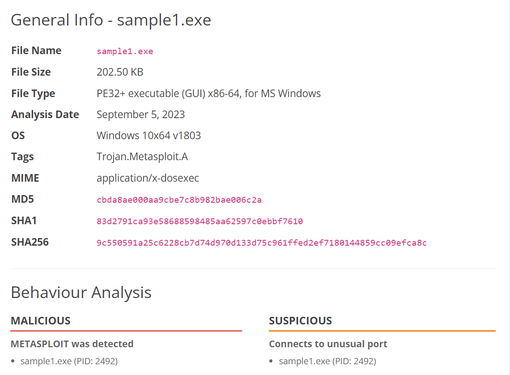

## Sample 2

Of course, hashing is at the bottom of the Pyramid of Pain, so it is extremely easy to bypass a hash blacklist. This second sample connects to an IP address for operation. A firefall rule can be made to combat this. 

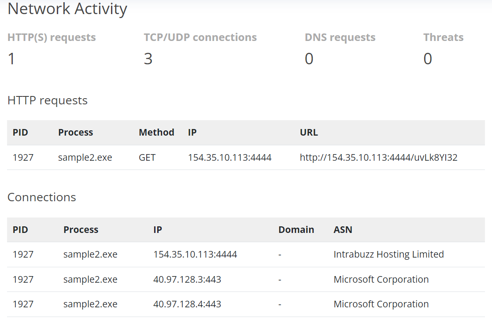
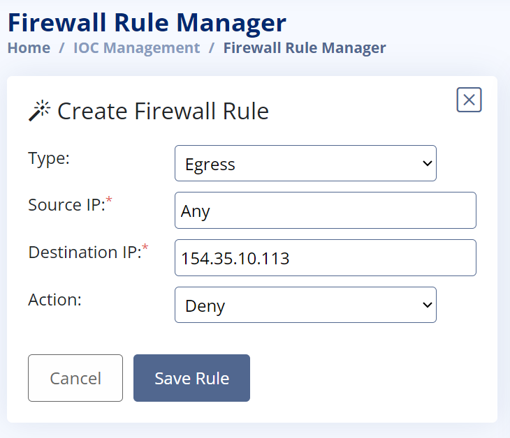

## Sample 3

IP addresses are fairly low down the pyramid, as they can be changed. This is where things get a bit more expensive. The malware seems to be connecting to a domain. I create a DNS rule to block this certain domain. For the attacker to progress with this payload, they must spend money to purchase a new domain.

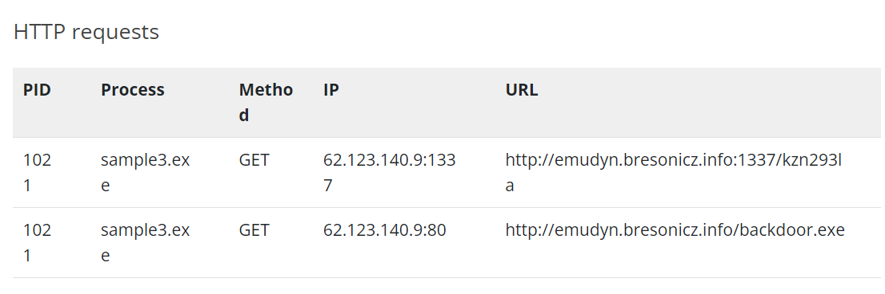
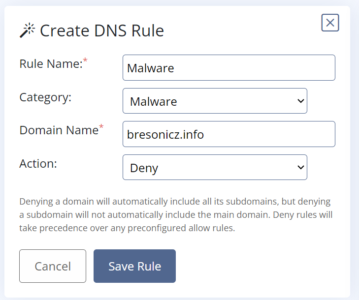

## Sample 4

The fourth malware sample seems to edit registry values. This is higher up on the pyramid of pain, as it is difficult to control the traces a malware leaves behind. This malware in particular seems to attempt to bypass defenses by disabling Windows' real-time monitoring. This is an example of Defense Evasion on MITRE ATT&CK. Luckily, I can create a Sigma Rule to block this. Please note that this CTF does not involve manual coding, but by inputting a few parameters.

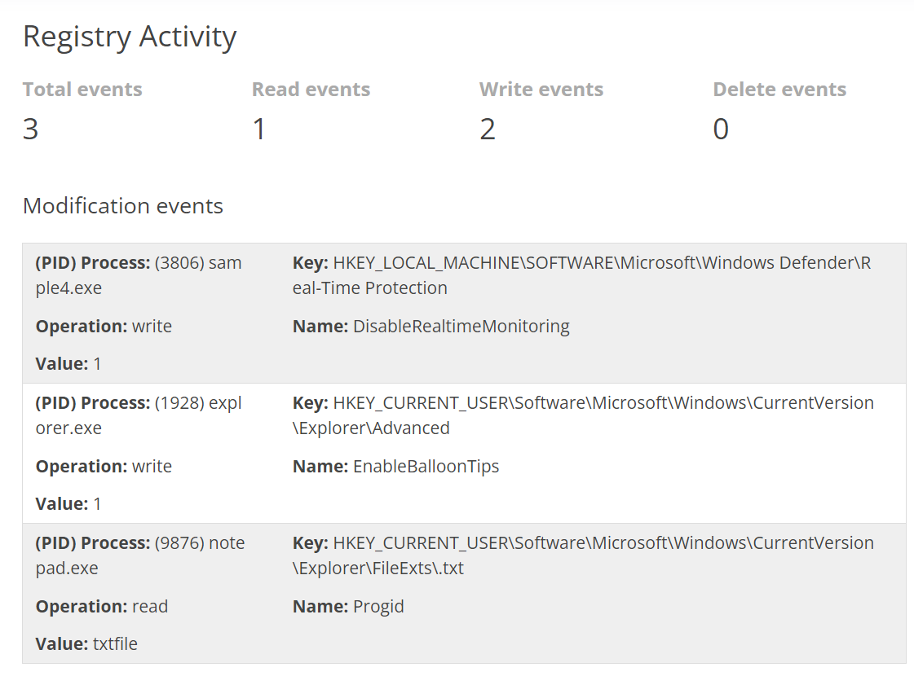
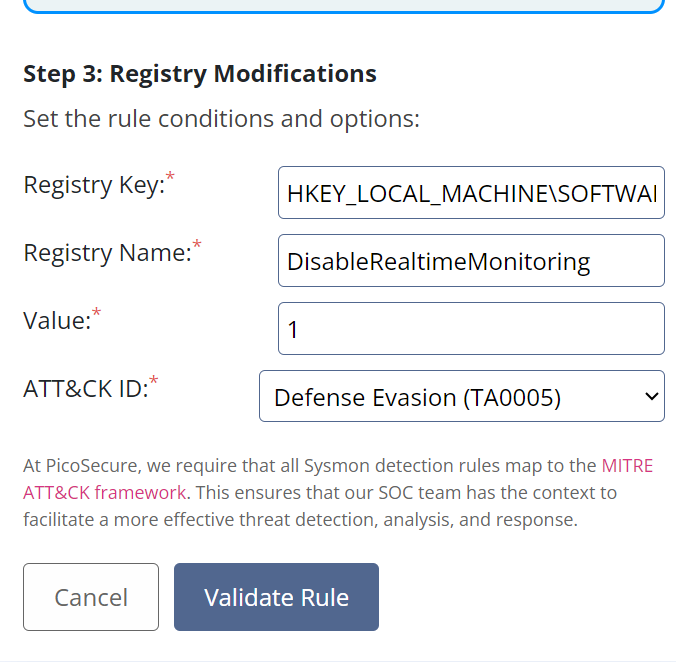

## Sample 5

This one is different from the other samples, as instead of getting the actual malware, I have to read through a network log. Looking through it, I notice that every 30 minutes, packets of 97 bytes are being sent out to one specific IP address. I decide to create another Sigma Rule. This rule detects the malware using the size of each packet and the frequency they are transmitted. Of course, I cannot set it to any dedicated IP address or port, as that is lower down on the Pyramid of Pain and is easier to bypass. This is higher up on the Pyramid of Pain, as the adversary cannot use periodic beaconing to a C2. 

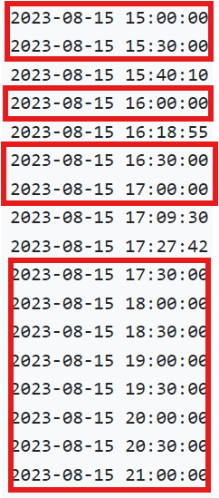
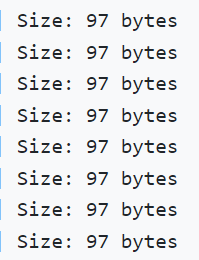
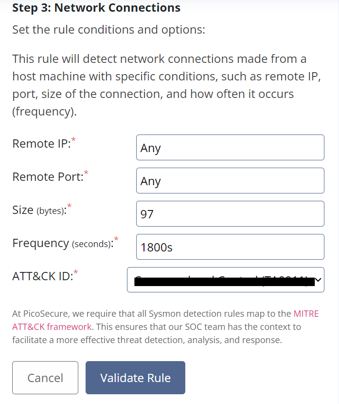

## Final sample

This last example is at the top of the Pyramid of Pain. Here, an attacker will have to develop new malware and spend more money. Most attackers would give up at this point. I am given a command history, the commands that the malware used for exfiltration. I create a third Sigma rule to detect and block this. I retrieve the final flag and complete the challenge

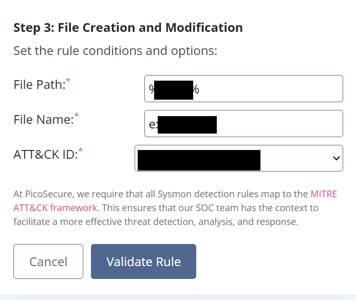

## What I learned

In this practical, I learned how to perform basic security engineering and malware analysis. I also learned how the Pyramid of Pain affects an adversary and how it prevents them from retrying an attack. 
