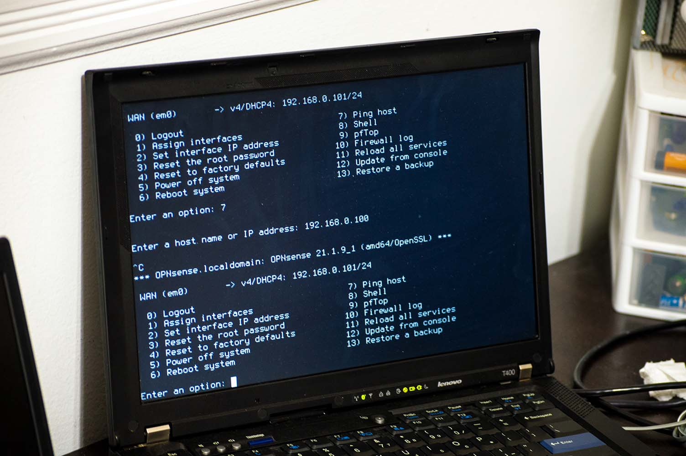
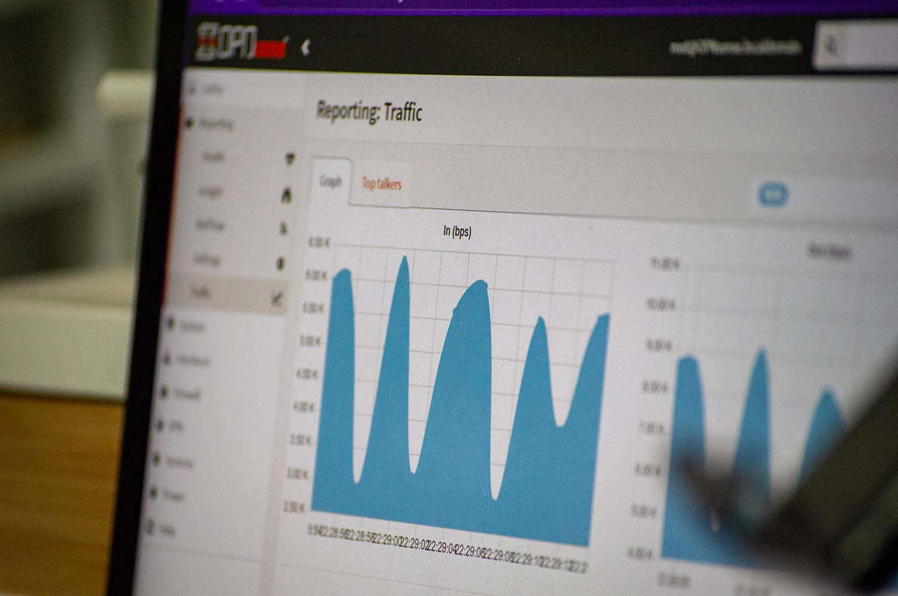
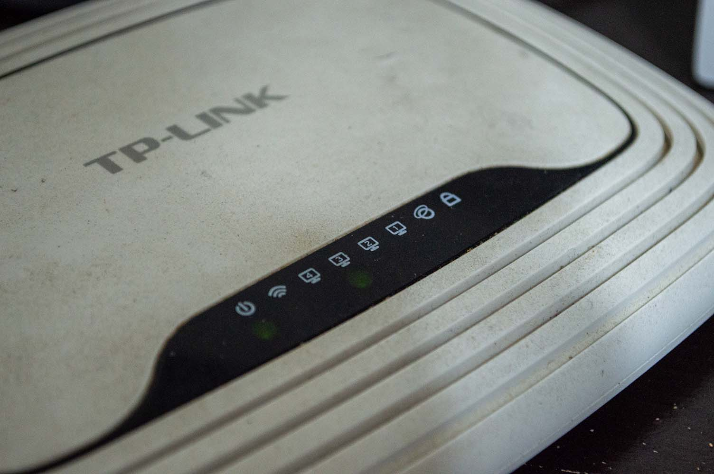
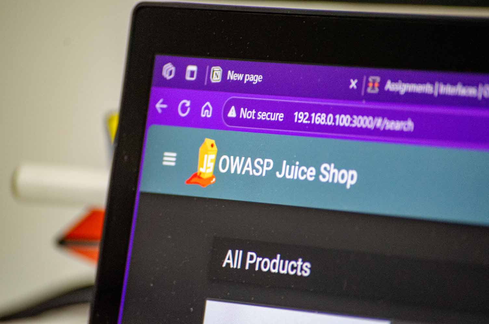

# Homelab Progress Check 2: Network and OWASP Juice Shop Setup
Date: 9/16/2025

## OPNSense
I've installed OPNSense on an old laptop to configure my private network. OPNSense is an open-source firewall and router software based on FreeBSD. I then connected OPNSense to a router, on which I set up an internal WLAN. This network is what I will run my homelab on. Note that this is not a public-facing network.

## OWASP Juice Shop
I will base this homelab on the OWASP Juice Shop. The OWASP Juice Shop is an intentionally insecure web application (Hence why this network is not public-facing. For this homelab, I will practice penetration testing, defending, and auditing on it.

## Next Plans
I will attempt to set up security solutions such as Elastic and Wazuh.
