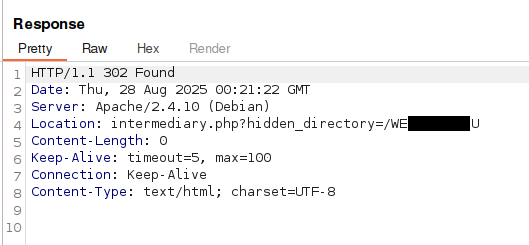
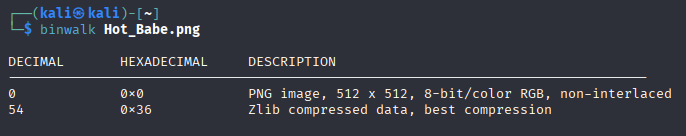
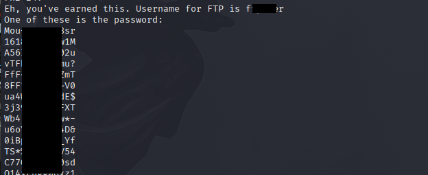
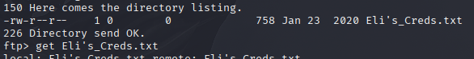
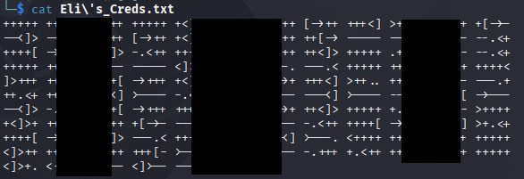
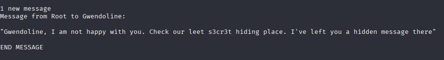
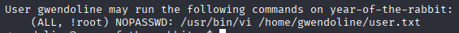

# Year of the Rabbit
*Note: the CTFs I have completed before 8/27/2025 are logged on [https://c1eb.webflow.io]*

**Completion date**: 8/27/2025\
**Platform:** TryHackMe, [https://tryhackme.com/room/yearoftherabbit]\
**Skills and Tools Used:** Network and Web Enumeration (Nmap, Gobuster, Burp Suite), Brute Forcing (Hydra), Decoding (Cyberchef and online tools), Privilege Escalation (GTFObins)

## Enumeration

Upon starting the CTF and the target machine, I use Nmap to scan for open ports. I find three open ports.

> ftp\
> ssh\
> http

I visit the HTTP webpage and enumerate it using a Gobuster directory scan. Unfortunately, there wasn't anything notable, except for `/assets`. Looking inside, there were only two files, a `css` file and `rickroll.mp4`. The rickroll file appeared to be a decoy, so I chose to check the `css` file instead. 

## Web Exploration
Inside the `css` file, there was a secret message telling me to head towards a secret `php` page. Upon accessing it, I get an alert message, prompting me to disable JavaScript, before getting redirected to _Never Gonna Give You Up by Rick Astley_. I head over to Firefox settings, disable JavaScript, and return to the secret directory. I do not get redirected this time, and get sent to a page telling me that "the hint is in the video". Unfortunately, the video in question is _Never Gonna Give You Up_, again. About one minute into the video, a generic text-to-speech voice informs me that I am looking in the wrong place. Not believing this, I watched to the end of the video, to find out that there was nothing else, and I really was looking in the wrong place. I look at the page source in hopes of finding anything, but nothing is uncovered. I downloaded the video in hopes of finding steganography hidden inside, but all binwalk returned was unreadable data. With a bit more analysis, I realize that the secret directory I went to was a `.php` file. I look at the address bar and realize that my current directory and the secret directory from the `css` file are ever so slightly different. Upon realizing this, I chose to analyze more deeply by using Burp Suite to intercept the HTTP message from the secret directory.

Inside the response, I find that the `Location:` header points to `intermediary.php`, with a query string to a hidden directory. I access this hidden directory and see a directory listing, with an image file, `Hot_Babe.png`. Assuming this is a case of steganography, I use binwalk to examine the image for extra data. 

Seeing Zlib compressed data, I extract it and attempt to read it, but the entire uncompressed data is humanly impossible to read. I look through everything and try all sorts of methods, but unfortunately, I do not find anything. Eventually, I try to use `cat` to read the PNG file as raw data, and lo and behold, the last lines give me an FTP username and password wordlist.

## FTP Access

I use nano to transfer the wordlist into a new txt file, and use Hydra to perform a dictionary attack on the FTP server. After a successful brute force, I connect to the FTP server, and I see a file named `Eli's_Creds.txt` and read it.

What comes out is the strangest encoding I have ever seen. With a bit of research, though, I find out that this is actually a programming language called Brainf**k. I use an online decoder and retrieve Eli's account credentials. 

## SSH and Privilege Escalation

Once I SSH into the target, I see a message:

This message is a huge hint, so I decide to use the command `find / -name "s3cr3t*"` to locate the secret directory. I `cd` to it and use `ls -a`, finding a file with Gwendoline's password. Using these credentials, I log in to Gwendoline's user and retrieve the first flag, user.txt. From here, I need to escalate my privileges to be able to read root.txt. Luckily for me, after using `sudo -l`, I saw that Gwendoline could run `sudo` on the `vi` command. 

Unfortunately, I could run sudo as anything *except* root. From here, I was at a dead end. After trying to bypass this for 30 minutes, I decided to use a write-up to learn what to do. Turns out, bash has a vulnerability where if you set your user ID to a negative number, it gets clamped back to 0, which is the user ID of root. Using GTFOBins and vi, I spawn a root shell and retrieve root.txt, finishing the CTF.

## Lessons Learned
This practical CTF has helped me practice my Enumeration and Burp Suite skills, but I also learned about a bash user ID vulnerability that could be exploited on Linux distributions released before late 2019.
