# Upload Vulnerabilities Challenge Task
**Completion date**: 8/30/2025\
**Platform:** TryHackMe, [[TryHackMe | Upload Vulnerabilities](https://tryhackme.com/room/uploadvulns)]\
**Skills and Tools Used:** Enumeration/Directory Brute Forcing (Gobuster), File Upload Bypass (Burp Suite), Reverse Shells (Netcat, MsfVenom)

***Warning: Spoilers Ahead!***

## Preface
This is the capstone challenge at the end of the Upload Vulnerabilities TryHackMe room. This room teaches about how to bypass upload restrictions and filtering.

## Initial Enumeration
The main page of the challenge greets me with a file upload screen. I first attempt to get a basic understanding of how the filtering works here, so I upload a file that should be accepted, a JPG file, which indeed is compliant with the file upload filtering. I then try to upload a PHP reverse shell, which, to not much of a surprise, is denied.

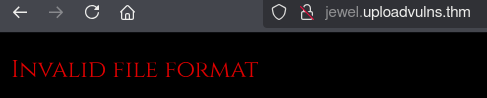

From here, I will now dive a bit deeper to see what filters are in place. I look through the page source and discover a JavaScript file that seems to be the website's client-side filter. Luckily, this is extremely easy to bypass. I first upload a regular `.jpg` file, then intercept the POST request using Burp Suite. 

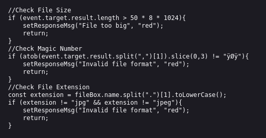

## Bypassing File Upload Restrictions

I read the POST request I intercepted, and noticed two things.
1. Contained inside braces, there are three parameters, `name: `, `type: `, and `file: `
2. Inside `file: `, there are three more parameters, each separated by a comma. The parameters in question are the data type, the encoding used for the data, and the data itself

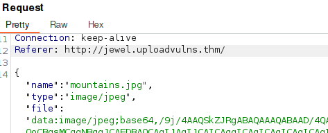

So, all I have to do is replace the data from the `jpg` image I uploaded with a `php` reverse shell, and add `.php` to the end of the filename. However, I assume that the website has server-side filtering too, so I keep `.jpg` before `.php`, so that if the server-side filtering only looks for `.jpg`, my payload will go through. I also attempt to bypass magic number checks by spoofing the first few bytes of my payload to be that of a `jpg` image (If you are wondering, most files should start with a few bytes, unique to its file type). After uploading it, I get a success response, meaning that I have successfully sent over the payload. 

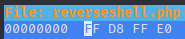
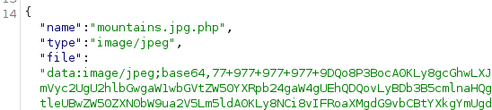

However, there was also something else worth checking out. Inside the response header, I see `X-Powered-By: Express`. This isn't usually in an HTTP response header, so I do some research and find out that Express is an extension to the Backend language, Node.js. This means that the server handles these uploads with Node.js, not PHP, indicating that my PHP payload was most likely useless. Although I was disappointed at this, I was happy I caught it sooner before I did more.

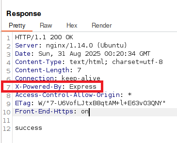

I decide to create a new payload using Metasploit's `msfvenom`, and repeat the same steps as before, successfully uploading the payload into the server. From here, I just need to figure out where the payload is stored and execute it.

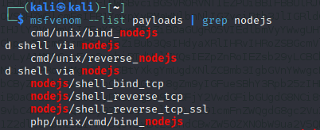
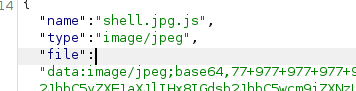

## Enumeration, Part 2
To find where uploads are stored, I use Gobuster to enumerate for directories. Two directories pique my interest, but the directory, `/admin` is especially interesting, due to Gobuster returning a success code 200. The other directory, `/content` is probably where my upload was stored. Unfortunately, I am forbidden to read this directory.

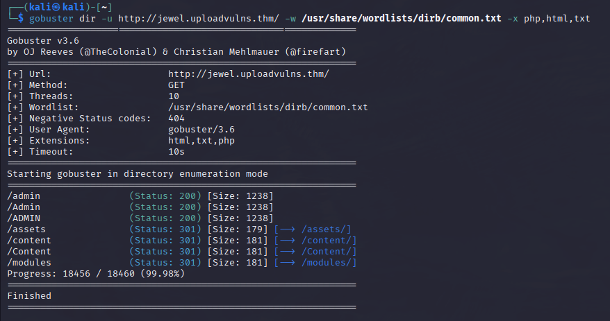
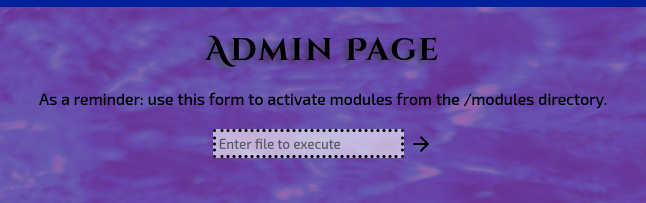

## Admin Panel Access and Enumeration, Part 3
This admin panel requires no Authentication, which is a huge security risk, but nonetheless, it will be a huge help for completing this challenge. With this admin panel, I will be able to execute any file inside `/modules`. I input the name of the file I uploaded, but unfortunately for me, it seems that my file is not located in `/modules`, but instead `/content`. I decide to use the dot-dot-slash attack, moving up a directory, out of `/modules`, and into `/content`. But even after doing this, my payload still does not execute. From here, I have two hypotheses.
1. The server is filtering out `../`, and preventing me from using it
2. Uploaded files do not retain their original name, and a completely different naming scheme is being used.

I assume that the latter has been used, considering that this challenge conveniently gives us a wordlist. I return to the homepage, where a slideshow of images is playing. I open the images in a new tab and see that the naming scheme uses 3 random capital letters and that the images are stored in the `/content` folder. 

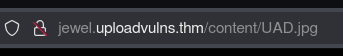
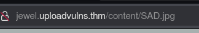
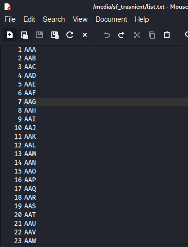

I assume that my uploaded payload is stored here, so I use Gobuster and the challenge's given wordlist to enumerate through `/content`. However, once Gobuster finishes, I do not see my payload anywhere. The entire directory consists of only .jpg files. 

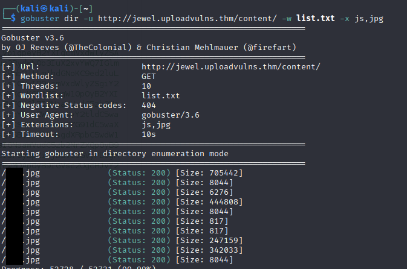

Thinking that my payload had naming schemes that confused Gobuster, I reuploaded my payload without `.jpg` in its name. Luckily, this file is still accepted. I uploaded this payload twice in hopes that Gobuster could catch it easier. Unfortunately, I still cannot find my payload in Gobuster's output. I now know for sure that my payload is somewhere inside the `/content`, as Gobuster returns more results each time I add my refined payload. I come to another hypothesis, where my payload's extension is being renamed to `.jpg` due to its MIME type being `jpg`.  This hypothesis could also be the reason why some images throw an error when I try to access them. 

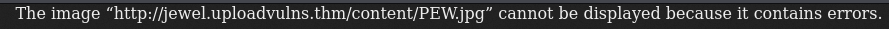

I remove the magic numbers at the start of my payload, and surprisingly, the server still accepts my payload. I rerun Gobuster, but my payload is still unfortunately a JPG. But suddenly, something clicks inside of me. I realize that my payload does not have to be a `.js` file, but just has to be executed like one. This is where I return to the admin panel, execute my payload, even though it is still a `jpg`, and connect it to my Netcat listener. I catch a reverse shell, retrieve the flag, and finish the challenge.

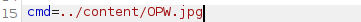

## Lessons Learned
Here, I was able to practice bypassing file filters and refine payloads to conform to restriction rules. This challenge refined my skills in these areas and allowed me to apply theory to  practical scenarios.
